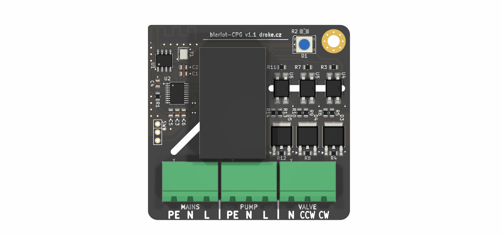

# BleRiot Circulation Pump Group Controller

CPG is a mains-powered BleRiot node for controlling a circulation pump and a
motorized 3-way or 4-way valve in floor-heating and radiator-heating circuits.
It provides one switched output for the pump and two interlocked directional
outputs for a reversible valve actuator.



The board is intended for supervisory heating control. Its triac channels are
on/off outputs; they are not phase-angle dimmers.

## Functions

- Circulation pump on/off control.
- Clockwise and counter-clockwise valve actuation.
- Firmware interlock preventing both valve directions from being energized at
  the same time.
- 100 ms break-before-make delay when changing valve direction; the latest
  command received during the delay wins.
- PAN2110 sub-GHz radio running the BleRiot register protocol.
- WS2812 status LED for local state indication.
- Onboard PY32F030 microcontroller and mains-to-3.3 V power module.

This arrangement supports common motorized mixing and diverting valves whose
actuator has a neutral connection and separate CW and CCW live inputs. Confirm
the actuator wiring and required reversal delay against its documentation.

## Connections

Connector numbering follows the KiCad schematic and PCB footprints.

| Connector | Pin | Function |
| --- | ---: | --- |
| J1 `MAINS` | 1 | Protective earth (PE) |
| J1 `MAINS` | 2 | Neutral (N) |
| J1 `MAINS` | 3 | Line (L) |
| J2 `VALVE` | 1 | Valve neutral (N) |
| J2 `VALVE` | 2 | Valve CCW switched live |
| J2 `VALVE` | 3 | Valve CW switched live |
| J3 `PUMP` | 1 | Protective earth (PE) |
| J3 `PUMP` | 2 | Pump neutral (N) |
| J3 `PUMP` | 3 | Pump switched live |

The three switched outputs use BTA08S-600CW triacs driven through MOC306x
optotriacs. The pump channel is independent. Valve CW and CCW share a firmware
interlock and must also be treated as mutually exclusive by any external
controller.

## BleRiot Registers

| Tag | Name | Type | Meaning |
| ---: | --- | --- | --- |
| 1 | `vcw` | bool | Valve clockwise output |
| 2 | `vccw` | bool | Valve counter-clockwise output |
| 3 | `pump` | bool | Circulation pump output |

A value of `0` is off and `1` is on. During valve reversal both valve registers
report off until the dead time expires and the pending direction is energized.
Null and unknown writes are ignored, and other boolean values are normalized to
`1`. The former test-only LED register is retired.

The status LED is automatic:

| Operating state | LED indication |
| --- | --- |
| All outputs off | Dim yellow |
| Pump on, no valve active | Dim green |
| Valve CW active | Red |
| Valve CCW active | Blue |

Valve state has priority over pump state. During valve dead time, the LED shows
the pump indication when the pump is on and the idle indication otherwise.

## Firmware And Pin Mapping

The firmware targets a PY32F030F1 MCU and controls a PAN2110 radio over
three-wire SPI.

| Function | MCU pin | Schematic net | Behavior |
| --- | --- | --- | --- |
| Pump | PB4 | `PUMP` | Active-low output |
| Valve CCW | PB5 | `VALVE_CCW` | Active-low output |
| Valve CW | PB6 | `VALVE_CW` | Active-low output |
| Status LED | PB7 | `LED` | WS2812 data |
| PAN2110 CSN | PF3 | `~RF_CS` | Active-low chip select |
| PAN2110 SCK | PA2 | `RF_SCK` | Clock |
| PAN2110 data | PA3 | `RF_DATA` | Bidirectional data |

At startup, firmware preloads PB4-PB6 high before changing them to outputs so
the active-low optotriac inputs remain off. All three switched outputs start
off. The status LED starts with the idle indication.

There is no mains zero-cross input. The MOC306x optotriacs shown in the
schematic are zero-cross devices, so these channels provide on/off switching
only.

## Repository Layout

- [`board/`](board/) contains the KiCad schematic, PCB, BOM, and fabrication
  outputs.
- [`fw/`](fw/) contains the TinyGo BleRiot node firmware and host-side inventory
  tool.
- [`burgrp/tinygo-drivers/ws2812`](https://github.com/burgrp/tinygo-drivers/tree/main/ws2812)
  contains the reusable 24 MHz PY32 WS2812 driver.
- [`sub/hw-kicad/`](sub/hw-kicad/) is the shared KiCad library submodule.

Initialize the hardware library after cloning:

```bash
git submodule update --init --recursive
```

## Build And Test

The firmware requires Go, TinyGo with the PY32 target support used by this
project, GNU Arm Embedded binutils, and pyOCD with the Puya device pack.

```bash
cd fw
go test ./...
go run . make cpg build
```

The BleRiot build command generates the node entrypoint with its configured RF
identity and produces `fw/image.elf` for `py32f030x8`.

The first board was programmed through a WCH-Link at 100 kHz using an
under-reset connection. With the board connected:

```bash
cd fw
go run . make cpg flash
```

Confirm the fitted MCU density before relying on the `py32f030x8` target. Check
the physical board before using X1: older board revisions route the SWD header
labels to the wrong MCU pins and do not expose target voltage or reset.

## Hardware Status

The current firmware has been built, flashed, and exercised on the board:

- PAN2110 startup was confirmed over RTT on BleRiot channel 37 with spread
  factor S8.
- Safe startup was confirmed with pump, CW, and CCW outputs all off.
- The valve interlock and latest-command state machine are covered by host
  tests.
- The WS2812 waveform and all RGB channels were validated at 3.3 V.
- The idle color was visually calibrated to dim yellow.

End-to-end testing with the intended pump, valve actuator, heating controller,
and RF hub is still required for each installation.

## Safety

This design connects directly to hazardous mains voltage. Assembly,
installation, testing, and enclosure work must be performed by suitably
qualified people using applicable electrical codes and safe isolation
practices.

Before deployment, independently verify at least:

- Input fusing and upstream over-current protection.
- PCB creepage and clearance for the applicable mains category.
- Protective-earth continuity and enclosure construction.
- Triac current, thermal, and inductive-load commutation margins.
- The exact MOC306x trigger-current grade and the fitted 270 ohm input resistor.
- WS2812 operation at 3.3 V, below the linked part's specified supply range.
- Pump and valve actuator voltage, current, wiring, and duty-cycle limits.
- Required valve reversal delay and behavior after RF or controller loss.

Outputs retain their commanded state until another command or reset. Define
radio-loss behavior and maximum pump and valve run times for the installation.

Do not connect a pump, valve, or mains supply based only on the connector table;
verify the assembled board against the schematic, PCB, and the equipment
manufacturer's wiring documentation.
